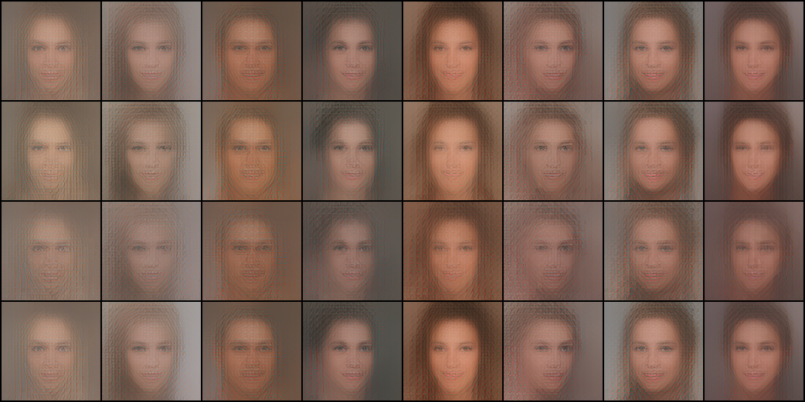
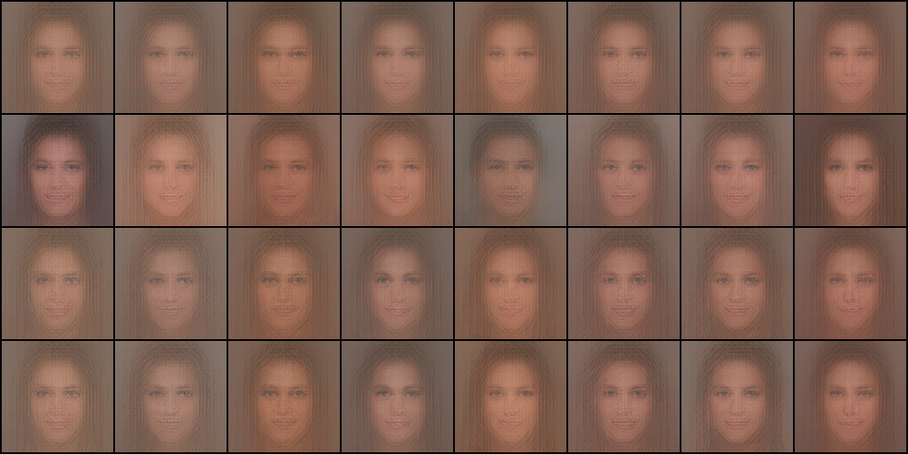

# Diffusion models are schizophrenia machines

Sander Dieleman made a compelling case that [diffusion is spectral autoregression](https://sander.ai/2024/09/02/spectral-autoregression.html):
Gaussian noise drowns the high frequencies of an image first, so denoising recovers
an image coarse-to-fine, band by band, like autoregression over frequencies. That is
the signal-processing view of what diffusion models do.

Here is a complementary, more psychiatric view: **diffusion models work because we
train them to see things in noise, and then we hand them *pure* noise and let them
free-associate.** The sampler is a loop that repeatedly asks "what do you see in
this?" of a model that is structurally incapable of answering "nothing." Every
sample a diffusion model has ever produced is a hallucination, elaborated over a few
dozen steps into something that looks like a memory.

To make that concrete, I trained a small zoo of models, most of them deliberately
broken: one that only ever saw pure noise, one that only ever saw 90%-noise, one
trained normally, and one trained blind to its own noise level. Along the way we'll consult
the mathematically perfect denoiser (it turns out to be the maddest one), bolt the
broken models together into a working sampler, and spoof a model's grip on reality
with a volume knob. But first, the setup.

## Setup

Everything below is flow matching on the 28,000-image train split of CelebA-HQ
(the dataset has 30,000; the remaining 2,000 are the standard validation split) at
128×128, in the latent space of the FLUX.2 VAE, with a tiny (22M parameter) DiT.
The convention:

```
x_t = (1 − t)·x0 + t·x1        x1 ~ N(0, I)
```

so `t = 1` is pure noise and `t = 0` is a real (latent of a) face. The model
predicts the velocity `v = x1 − x0`, and sampling integrates the ODE from `t = 1`
down to `t = 0` with Euler steps: `x ← x + (t_next − t)·v(x, t)`.

One identity worth keeping in your head: at any point during sampling, the model's
velocity prediction implies a belief about what the final image is,

```
x̂0 = x_t − t·v(x_t, t)
```

which we can decode and look at. This "implied x0" is the model showing you what it
currently thinks is hiding in the noise.

## The model that could only tell the truth

First experiment: train a flow matching model **only at t = 1**. It only ever sees
pure noise as input, and is asked to predict `x1 − x0` for random pairings of noise
and data.

At t = 1 the input contains *zero* information about the target image — `x_t = x1`,
and `x1` was drawn independently of `x0`. The loss-minimizing prediction is the
conditional expectation, which collapses to the unconditional one:

```
v*(x1) = E[x1 − x0 | x1] = x1 − E[x0]
⇒ x̂0 = x1 − v*(x1) = E[x0]     — the dataset mean, regardless of input
```

The optimal t=1 model is a *sane* model. Shown noise, it refuses to see anything
in particular. It reports only its prior: the average of every face it has ever
seen.

And that is exactly what training finds. Sixteen different noise samples, one
prediction step each:


Sixteen inputs, one face: softly lit, facing straight forward, ambiguously gendered,
background averaged to studio haze. It is essentially the decoded dataset-mean
latent (below) — the celebrity that CelebA-HQ converges to if you stack all 28,000
faces on top of each other:


This face is the correct answer. It is what honesty looks like when you are asked
"what face is in this noise?" and the true answer is "no face is in this noise."

## The model that was taught to see things

Second experiment: train an otherwise identical model **only at t = 0.9**. Now the
input is `0.1·x0 + 0.9·x1` — a real face buried under nine parts noise. There *is*
signal, faint but real: pose, hair mass, background tone, skin brightness all leak
through at 10% amplitude. The model's job is to amplify a whisper. And it learns
to — fed genuinely noised real images, its one-step reconstructions are still
shrunk hard toward the mean face (which is Bayes-correct at this SNR: the posterior
is wide, and its mean is close to the prior's), but the real signal visibly leaks
through: background color, hair darkness, overall palette track the original:


(rows: original / the 90%-noised input, decoded / one-step reconstruction)

Now the abuse: feed this model **pure noise** — the one input distribution it has
never seen, containing no face at all — while telling it `t = 0.9`. A model that
"knew" its input was informationless would output the mean face, like the t=1 model.
Instead:


Same sixteen noise samples as before. But this model was never allowed to learn
"sometimes there is nothing there." Its entire training pressure went into
extracting structure from near-noise — so when there is no structure, it extracts
it anyway. It looks into static and sees women, men, children, smiles, glasses,
lighting, backgrounds. Every one of these faces is a confabulation: the pose it
"recovers" was never put in.

The numbers agree. (Throughout this post, *diversity* means the mean pairwise L2
distance between outputs in latent space, computed over 256 inputs; the ± is a 95%
CI estimated from 16 disjoint 16-sample groups. The figure grids show the first
few of the same seeds.)

| source | diversity |
|---|---|
| t=1 model, one step from pure noise | 10.8 ± 0.1 |
| t=0.9 model, one step from pure noise | 27.3 ± 0.3 |
| full model, 64-step Euler samples | 81.9 ± 0.5 |
| real data | 111.6 ± 0.9 |

The t=1 model's outputs collapse to (numerical noise around) a point. The t=0.9
model, given *less* information than it was trained with — none instead of a
whisper — produces 2.5× more diverse output. That extra diversity cannot come from
the input; pure noise specifies no face. It comes from the model: its learned
feature detectors resonating with whatever accidental correlations happen to be in
each particular draw of static. This is pareidolia as a mechanism. The model
hallucinates — sees patterns that are not there — *because it was trained to*, and
the hallucinations are diverse because each patch of static tickles different
detectors.

There's a sharper way to put it. Compare the t=0.9 model's behavior on inputs that
*do* contain a real face against pure noise:

| t=0.9 model input | output diversity | output distance to mean face |
|---|---|---|
| real images, 90% noised | 31.3 ± 0.8 | 23.1 ± 0.4 |
| pure noise | 27.3 ± 0.3 | 24.6 ± 0.3 |

The gap is real but small: the model's response to *nothing* is about 87% as
spread out as its response to *something*, and sits slightly *farther* from the
mean face. Deleting every trace of genuine signal from its input barely dents its
output distribution. It has no representation of "there is no signal here" strong
enough to change its behavior by more than a few percent — it extracts a face's
worth of structure either way, whether the structure was planted by a real
photograph or by the whims of a random number generator.

## Is it *really* hallucinating? Asking the exact optimal denoiser

A fair objection at this point: even a Bayes-optimal denoiser is a function of its
input, so of course it produces diverse outputs on diverse inputs. Maybe the t=0.9
model isn't "seeing things" — maybe it's just correctly computing a posterior that
happens to be input-sensitive. Conveniently, for a finite training set the optimal
denoiser isn't hypothetical. It has a closed form:

```
E[x0 | xt] = Σᵢ softmax_i( −‖xt − 0.1·xᵢ‖² / (2·0.9²) )·xᵢ
```

a posterior-weighted average over all 28,000 train-split latents — one big matrix
multiply. So we can ask directly: shown pure noise at "t = 0.9", what would the
*perfect* student of this training set see? And is that what our network learned?


(rows: optimal denoiser's prediction / the training image it retrieved / trained
model's prediction / the training image nearest to the model's prediction — same
pure-noise input per column)

The optimal denoiser turns out to be the maddest thing in this post. Shown pure
noise, it doesn't output a cautious blur — it **retrieves specific training
images**, nearly verbatim: the top training image gets 61% of the posterior mass on
average, and the effective number of images contributing is about 2.8. The logits
have a standard deviation of ~10 nats across the training set, so the softmax is
essentially a nearest-neighbor lookup — in every draw of static, the perfect
memorizer sees *a particular photograph it has memorized*, with high confidence.
Its outputs sit at distance 33 from their nearest training image — for scale, the
average distance from a real latent to its *nearest neighbor* in the training set
is 88.5 ± 1.4 (note this is a different yardstick from the pairwise-diversity
numbers above, which average over all pairs, not nearest neighbors). These are
memories, lightly blended.

The trained network does **nothing of the sort**. Its outputs on the same inputs
sit at distance 69 from the nearest training image — almost as far as real faces
sit from each other — and its nearest training image coincides with the optimal
denoiser's retrieval in exactly 0 of 16 cases. The network isn't approximating the
empirical posterior and failing; it's computing a different function altogether.
It absorbed the *statistics* of faces and synthesizes novel ones, where the exact
solution to its training objective would regurgitate the dataset.

This is the single-noise-level version of what Kadkhodaie, Guth, Simoncelli and
Mallat showed more generally: generalization in diffusion models *is* the gap
between the trained denoiser and the memorization-optimal one
([ICLR 2024](https://arxiv.org/abs/2310.02557)).

One concession, to be precise about what this does and doesn't show. "Optimal"
above means optimal *for the empirical training set*. The population-optimal
denoiser — the one you'd get with infinite data from the true face distribution —
would also produce diverse, novel, plausible faces from pure noise. Invention is
not a pathology of imperfect training; it is exactly what correct generalization
looks like, and our network's behavior is (a crude, 2,500-step approximation of)
the *right* thing. So the line to take away is not "the network hallucinates
because it failed to optimize." It's this: there are two ways to see a face in
static — recall one, or invent one. The exact solution to the training problem
recalls (that's the memorization regime, and it's why small-data diffusion models
leak training images). The thing we actually want, and the thing the network's
inductive biases luckily deliver, invents. Either way, nothing sane is on the
menu: the training objective offers no option to see nothing. Relative to the
empirical optimum, a diffusion model is useful because it hallucinates *worse than
optimally* — which is to say, better than the finite data alone could justify.

## The train–test mismatch is the product, not the defect

Why does this matter for real diffusion models? Because standard sampling quietly
runs the same abuse at every step.

During training, `x_t` is always manufactured from a *real* image: at t = 0.9, a
genuine face is vaguely present in the input, and the target velocity points at
that face. During sampling, the state at t = 0.9 is manufactured by *the model
itself*: we take pure noise at t = 1 and take one Euler step. But the model's
velocity at t = 1 points at the dataset mean — it can do nothing else, as we just
saw. (This isn't an artifact of the crippled t=1-only model: a normal model trained
on all of t ~ U(0,1) produces the same sixteen-identical-mean-faces grid when
queried in one step from t = 1 — see [fig4](outputs/fig4_full_onestep_t1.png). Yet
the same model run for 64 Euler steps produces properly diverse faces —
[fig5](outputs/fig5_full_euler_grid.png) — with diversity 81.9 against the real
data's 111.6: about 73%, a real under-dispersion gap of the kind deterministic ODE
samplers are known for, but in the right league.) So the synthetic state at
t = 0.9 is

```
x_0.9 = x1 − 0.1·(x1 − E[x0]) = 0.9·x1 + 0.1·E[x0]
```

noise plus a faint *mean face* — front-facing, symmetric, generic. If the model at
t = 0.9 simply "continued down the path" its own state suggests, every sample would
sharpen the mean face and the model would only ever produce front-facing averaged
people. It does not. The faint frontal mean face gets overruled: continue sampling
and you get profiles, lighting from the side, hats, beards — details flatly
inconsistent with the signal that was actually planted in the state.

You can watch this happen by decoding the implied `x̂0` along a normal sampling
trajectory of the full model (trained on all t):


(columns: t = 1.0, 0.95, 0.9, 0.8, 0.6, 0.4, 0.2, final)

At t = 1 the belief is the mean face — always. Over the next steps the belief
*mutates*: it drifts away from the mean toward some particular person that was
never in the state to begin with. The commitment is gradual and self-reinforcing:
whatever the model mis-sees at t = 0.9 gets baked into the state handed to
t = 0.85, which elaborates it further. Sampling is iterated hallucination with
commitment.

Contrast with what happens when the t = 0.9 state is *real* — noise a genuine image
to t = 0.9 and let the full model integrate down from there:


(top: original; bottom: result of sampling from its 90%-noised state)

Pose, palette, and composition survive. When there is actual signal, the model
follows it. When there isn't — as in the state its own first step manufactured — it
generalizes: it treats model-made noise-plus-mean-face like data-made
noise-around-*some*-face, picks whichever face its detectors resonate with in that
particular static, and runs with it. **Sampling is generative precisely because the
model reads the noise accidents in its own manufactured states as if they were
signal.** The face that comes out was never planted in the state; it was elicited
from it.

Two different gaps are in play here, and it pays to keep them apart:

- **Gap 1 — exposure bias**: model-made intermediate states versus data-made ones.
  This is well documented ([Ning et al., ICLR 2024](https://arxiv.org/abs/2308.15321)),
  uniformly treated as an error source, and at low noise levels it really does
  just degrade quality; a family of corrections exists to shrink it, and those
  corrections do not push the model toward memorization.
- **Gap 2 — generalization**: what the trained network computes versus what the
  exact empirical-Bayes optimum computes, on *any* input. This is where the
  content comes from. It operates even with zero exposure bias: hand the network a
  genuinely data-made state, as in the figure above, and it still generalizes
  rather than retrieves.

The division of labor: **the mismatch decides *where* the choice happens;
generalization decides *what* gets chosen.** The sampling loop's contribution is
to route trajectories through states whose "signal slot" contains noise accidents
rather than a real face — precisely the inputs on which the network's learned
structure-extraction has maximal freedom to act. Novelty itself comes from gap 2:
close it — train all the way to the exact empirical optimum — and sampling becomes
a very expensive photocopier of the training set, mismatch or no mismatch.

An honest theoretical footnote on the idealized limit. With the *exact* velocity
field of the true continuous data distribution and infinitesimally small steps,
the probability-flow ODE is a clean measure transport: no exposure bias at all,
diversity riding in on the initial noise through a deterministic map. Nothing
mystical, no hallucination vocabulary required. But that ideal is not available to
a model trained on a finite dataset — the nearest well-defined version of it is
the empirical-Bayes ODE, and integrating that turns sampling into retrieval. Every
novel face a real diffusion model produces comes from the network filling in the
transport map in regions the training objective never pinned down — which is the
precise, unsexy statement of "seeing things that aren't there."

## Frankenstein sampling: stringing the specialists together

If a diffusion model really is just a family of per-noise-level pattern-readers
wearing a trenchcoat, we should be able to *build* one out of our crippled
specialists. Take the schedule t = 1.0 → 0.9 → 0.0, and run it four ways on the
same noise samples:

1. **Chained specialists**: the t=1-only model takes the first Euler step, then the
   t=0.9-only model jumps to zero.
2. **Full model**, exact same two-step schedule.
3. **Reference**: the t=0.9 model fed the raw noise directly, no first step at all.
4. **The t=0.9 model taking both steps itself** — its first step moves 10% along
   its own hallucinated velocity, then it jumps to zero from the state it made.



(rows: chained / full 2-step / t09 direct / t09 both steps; columns share the same
starting noise)

| sampler | diversity |
|---|---|
| chained t1 → t09 | 25.4 ± 0.4 |
| full model, same 2 steps | 29.3 ± 0.3 |
| t09 direct on pure noise | 27.3 ± 0.3 |
| t09 taking both steps | 30.5 ± 0.6 |

Four observations, in increasing order of interest:

**The Frankenstein sampler works.** Two models that individually are pathological —
one can only draw the mean face, the other was never trained on its test input —
compose into a sampler that behaves like the full model on the same schedule. A
diffusion model has no global plan across time; it is behaviorally equivalent to a
bag of independent per-t denoisers consulted in sequence.

**The first step barely matters.** The t=1 step can only inject the mean-face
direction (that's all the t=1 model knows), and it shifts each final output a
little and shrinks diversity slightly (25.4 vs 27.3 direct). The faint frontal mean
face planted in the state does not win. The second model's pareidolia overrules the
only actual "signal" present.

**Doubling down beats sobering up.** The ordering of the diversity column is
telling — and with the error bars, the ordering is real. The *least* diverse
sampler is the one whose first step injects the honest mean-face direction
(chained, 25.4). The *most* diverse is the one whose first step
moves along the t=0.9 model's own confabulated velocity (30.5) — the model spends
its first step amplifying whatever it mis-saw in the static, then elaborates the
amplified version. Each step of self-conditioning entrenches the delusion; a step
of honesty dilutes it. This is the whole sampler in miniature: iterating a
hallucinating model on its own outputs is a diversity *pump*, and the final row is
visibly the most committed — sharper identities, stronger lighting choices — of the
four.

**The columns match.** Look down any column: the same starting noise yields a
recognizably similar face under all four samplers — same warm brunette in one
column, same cool-toned darker face in another. The identity of the hallucination
lives in the *noise*, not in the sampler. All four machines look at the same cloud
and see roughly the same rabbit — because they share training data and
architecture, they learned the same detectors, and the detectors resonate with the
same accidents of the static. The sampler doesn't choose the delusion; it only
develops it.

## Teaching it to say "nothing there" — and then spoofing it

One more model. Train on *both* t = 1.0 and t = 0.9 (50/50), but **remove the noise
conditioning**: the model's t-input is frozen, so it is never told which regime any
input came from. If it wants to behave differently on pure noise versus 90%-noised
data — and the training loss says it should — it must learn to *measure its own
input*. And the measurement is available: in this latent space (d = 8192), pure
noise has marginal std 1.0 and the t = 0.9 marginal has std ≈ 0.906, so the input
norm separates the two regimes almost perfectly. (Kaiming He's group showed
[noise conditioning is largely unnecessary](https://arxiv.org/abs/2502.13129) for
exactly this reason — the input betrays its own noise level.)

Four probes:

1. Pure noise, one step of size 1.0 — does it realize nothing is there?
2. Real images noised to t = 0.9, one step of size 0.9 — does it read the signal?
3. **The spoof**: the same pure noise as probe 1, rescaled by 0.906 so its norm
   masquerades as the t = 0.9 marginal. Nothing about its information content
   changes — only its loudness.
4. Two-step sampling, 1.0 → 0.9 → 0.0, with the model on both steps.



(rows: pure noise / real 90%-noised faces / pure noise rescaled ×0.906 / two-step
sampling with itself)

| input | diversity | dist. to mean face |
|---|---|---|
| pure noise | 9.5 ± 0.1 | 11.3 ± 0.1 |
| real images, 90% noised | 17.8 ± 0.2 | 14.9 ± 0.1 |
| pure noise, rescaled ×0.906 | 16.5 ± 0.0 | 15.3 ± 0.0 |
| two-step 1.0 → 0.9 → 0.0 | 16.8 ± 0.1 | 14.6 ± 0.0 |

Row 1: it learned the check. Shown pure noise, the unconditioned model collapses to
the mean face — *more* tightly than even the dedicated t=1 specialist (9.5 vs
10.8). Without being told anything, it diagnoses "this input contains nothing" and
declines to hallucinate. This is the only sane behavior any model exhibits in this
entire post, and the model invented it on its own.

Row 3 is the punchline. Multiply the same pure noise by 0.906 — change *nothing*
about its information content, just turn the volume down 9% so the norm lands where
the t = 0.9 marginal lives — and the sanity check waves it through. Diversity jumps
from 9.5 to 16.5, recovering over 90% of the model's response to *real* faces
under real noise (17.8 — the remaining sliver is a real gap, presumably the
genuine signal doing its modest work). Under this probe, the model's grip on reality
behaves like a norm detector — the spoof shows loudness alone is *sufficient* to
flip it, whatever else it may be measuring. Its hallucinations aren't gated by "is
there structure here?" but by "is this the loudness at which structure usually
occurs?"

Row 4 closes the loop: in ordinary two-step sampling the model *spoofs itself*. Its
honest first step at t = 1 (a small move toward the mean) produces a state whose
norm ≈ 0.9-marginal — which passes its own check — and the second step hallucinates
freely (16.8). Even a model with a working "there is nothing here" detector gets
laundered into confabulation by its own sampling loop, in one step. You cannot fix
the schizophrenia machine by teaching it to recognize noise; the sampler
manufactures inputs that fall inside its delusional regime by construction.

## Two views, one machine

The spectral autoregression view and the schizophrenia view are answers to
different questions.

Sander's frequency story explains **in what order the hallucination accretes**:
Gaussian noise is spectrally flat while images are power-law, so the noise floor
swallows high frequencies first; at any t, the frequencies just at the floor are
the ones being "decided." That's why the implied-x̂0 filmstrip sharpens
coarse-to-fine — pose before jawline before eyelashes. (One wrinkle: his argument
is about pixel-space spectra, and our models live in a VAE latent space, which is
partially whitened — the power law is flatter there, and the coarse-to-fine
ordering correspondingly softer. The filmstrip still shows it, but the crisp
band-by-band picture is a pixel-space idealization.)

The schizophrenia story explains **where the content comes from**. Autoregression
over frequency bands still needs something to condition on at the start, and at
t = 1 there is nothing — the first "token" is generated by a model that is forced
to see a face where there is none, and every later band elaborates that initial
confabulation. Diversity across samples is exactly the model's sensitivity to which
particular sample of static it was shown: information-free variation amplified into
identity, expression, lighting. A diffusion model is an engine for laundering noise
into detail, and the laundering step is precisely the "seeing things" our t = 0.9
model demonstrates in isolation.

I'd put it this way: *diffusion training builds a machine that maps noise floors to
plausible structure; diffusion sampling exploits that machine on inputs where the
structure was never there. Spectral autoregression tells you the schedule of the
delusion; generalization supplies the delusion itself.*

## Prior art

None of the individual pillars here is new; I think the assembly is. For the
record:

- The pareidolia analogy has been made in passing before, e.g. in
  [this xcorr post](https://xcorr.net/2023/02/06/denoising-diffusion-models-for-neuroscience/)
  on diffusion for neuroscience — as an analogy, not an experiment.
- The memorization-vs-generalization result that our empirical-Bayes section
  reproduces at a single noise level is
  [Kadkhodaie, Guth, Simoncelli & Mallat (ICLR 2024)](https://arxiv.org/abs/2310.02557),
  who also explain *what* the network's inductive bias is (geometry-adaptive
  harmonic bases).
- The train–test mismatch is the exposure-bias literature
  ([Ning et al., ICLR 2024](https://arxiv.org/abs/2308.15321) and successors);
  the inversion — mismatch as the generative mechanism at high noise — is the
  editorial position of this post.
- "Hallucination" also has an established, *different* technical meaning in
  diffusion: [Aithal et al. (NeurIPS 2024)](https://arxiv.org/abs/2406.09358) use
  it for mode interpolation — out-of-support artifacts like extra fingers. What
  this post describes is upstream of that: not the failure mode where samples fall
  between modes, but the mechanism by which any sample acquires content at all.
- That a denoiser can infer its own noise level from its input is
  [Sun, Jiang, Zhao & He (ICML 2025)](https://arxiv.org/abs/2502.13129); our
  unconditioned model is the two-noise-level toy version, plus the adversarial
  rescaling probe.

## Caveats, for the well-actually crowd

- "Schizophrenia" is used here the way everyone uses it in titles — clinically the
  right words are *pareidolia* (seeing patterns in noise) and *apophenia*, and no
  actual clinical claim is being made.
- "A Bayes-optimal denoiser would also be diverse on pure noise" — true, with a
  fork. The *empirical* optimum (finite data) is diverse by near-verbatim
  retrieval, and the trained model demonstrably isn't doing that (0/16 retrieval
  agreement, 2× the distance to the training set). The *population* optimum
  (infinite data) would be diverse by invention — behaviorally like our trained
  model. So "hallucination" here names correct generalization, not an optimization
  failure; see the concession in the empirical-Bayes section.
- Pure noise (std 1.0) is about 10% "hotter" than the t = 0.9 marginal the
  specialist trained on (std ≈ √(0.9² + 0.1²) ≈ 0.906) — so its inputs in the
  pure-noise experiment are detectably out-of-distribution, and the t=0.9
  specialist confabulates on them anyway. The unconditioned model shows both sides
  of this coin: it *can* learn to use that 10% gap as a sanity check, and the check
  is a pure norm detector you can spoof with a volume knob.
- In the exact continuous-time limit with the true population velocity field, the
  probability-flow ODE has no train–test mismatch and needs no "hallucination" —
  it's a deterministic measure transport. The framing in this post is about what
  *trained models on finite data* do, where that idealization is unattainable and
  its nearest attainable version (the empirical-Bayes denoiser) is a memorizer.
  See the theoretical footnote in the mismatch section.
- These are 2,500-step tiny models trained for a blog post, not SOTA anything. That
  is rather the point: none of these effects require scale, they fall out of the
  objective.

## Appendix: experimental details

- **Data**: CelebA-HQ train split — 28,000 of the dataset's 30,000 images — at
  128×128 (center-cropped from 256).
- **Latents**: FLUX.2 VAE (the ungated `FLUX.2-small-decoder` release: full FLUX.2
  encoder + distilled small decoder), 32×16×16 latents, per-channel normalized.
- **Model**: DiT, 22M params — patch 1 over the 16×16 latent grid, width 384,
  depth 8, 6 heads, adaLN-zero conditioning on t, fixed 2D sin-cos positions.
- **Training**: flow matching (linear interpolant, velocity target), batch 256,
  AdamW lr 3e-4, 2,500 steps per model, EMA 0.999, bf16 autocast. Each model is
  ~10 minutes on one RTX 3090.
- **Models**: `t1` (t ≡ 1), `t09` (t ≡ 0.9), `full` (t ~ U(0,1)), and `uncond`
  (t ∈ {1.0, 0.9} with probability ½ each, conditioning input frozen to 0).
- **Sampling**: Euler. 64 steps for the full model's sample grid and trajectory
  filmstrip; one or two steps everywhere else, as described per experiment.
- **Diversity metric**: mean pairwise L2 distance between outputs in normalized
  latent space; "distance to mean" is L2 to the dataset-mean latent. All table
  numbers are computed over 256 inputs; the ± is a 95% CI from the SEM across 16
  disjoint 16-sample groups. Distances quoted in the empirical-Bayes section
  (33, 69) are over the 16 inputs shown in the figure; the 88.5 yardstick there is
  mean *nearest-neighbor* distance among training latents, not mean pairwise.
- **Code**: this repo. `train.py --t-mode {t1,t09,full,uncond}`, then
  `experiments.py` (core figures), `experiment_chain.py` (Frankenstein),
  `empirical_bayes.py` (optimal denoiser), `experiment_uncond.py` (spoofing),
  `variance_check.py` (all table numbers with CIs).
