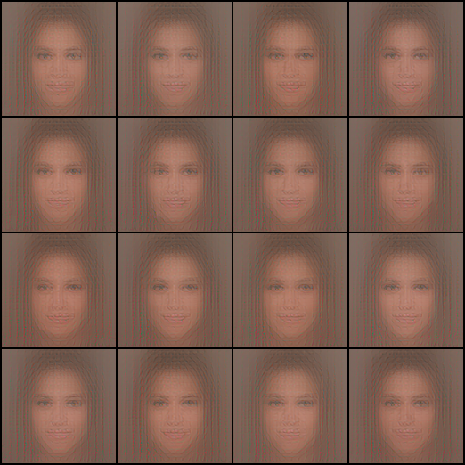
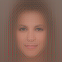
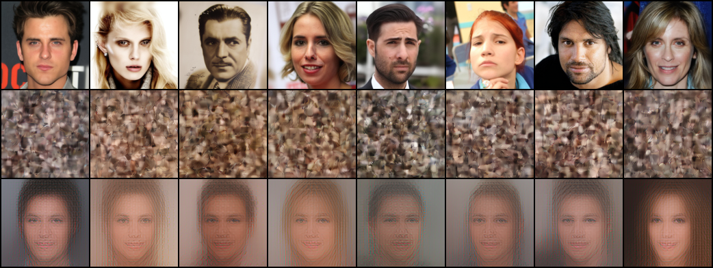
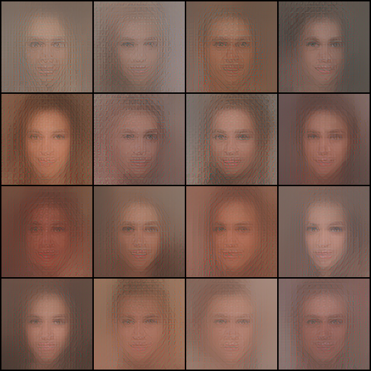
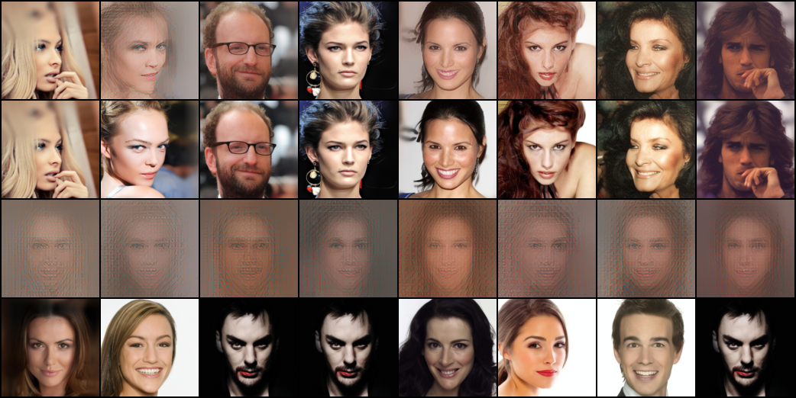
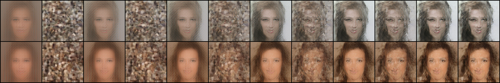
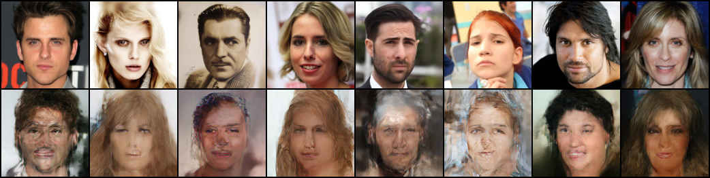
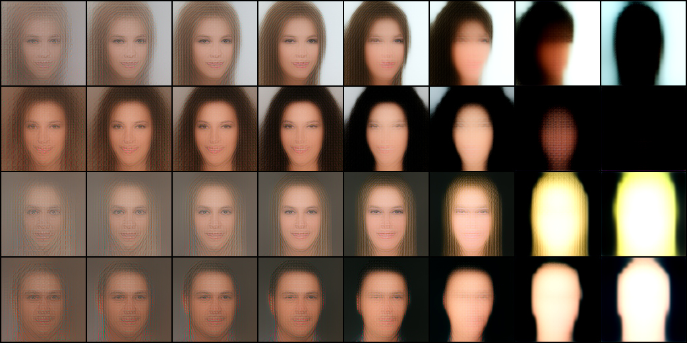

# Diffusion models are schizophrenia machines

Sander Dieleman made a good case that [diffusion is spectral autoregression](https://sander.ai/2024/09/02/spectral-autoregression.html):
noise drowns the high frequencies of an image first, so denoising recovers an image
coarse-to-fine, like autoregression over frequency bands. That's the
signal-processing view.

Here's a more anthropomorphic one: **diffusion models work because they see patterns that aren't there**.
There is a large train-test mismatch when sampling from them, but because they're only ever trained to predict flows toward the real data manifold, their generalization still gives us useful outputs.

To demonstrate, I built my own madhouse of broken models.

## Setup

Flow matching on the 28,000-image train split of CelebA-HQ at 128×128, in FLUX.2
VAE latent space, with a 22M-parameter DiT:

```
x_t = (1 − t)·x0 + t·x1        x1 ~ N(0, I)
```

t = 1 is pure noise. The model predicts the velocity `v = x1 − x0`

Normal sampling uses Euler integration with small steps to reach the clean image. However, at any point during sampling, the velocity prediction implies a belief about the final image,

```
x̂0 = x_t − t·v(x_t, t)
```

which we can decode and look at.

## The model that gave up trying

Train a model **only at t = 1**. Its input is pure noise, drawn independently of
the target, so the loss-minimizing prediction is the unconditional mean:

```
v*(x1) = x1 − E[x0]    ⇒    x̂0 = E[x0]
```

The dataset mean, whatever the input. The optimal t=1 model *has given up*: shown noise,
it refuses to see anything in particular and reports its prior. And that's what
training finds. Sixteen different noises, one step each:



One face, sixteen times: a front-facing floating head. It's the decoded dataset-mean latent:



The model was never given any hint at all as to what the output could be, so it cannot commit to any specific face. It gives up and just produces the average of the dataset.

## The model that started seeing things

Now train an identical model **only at t = 0.9**. Its input is `0.1·x0 + 0.9·x1`. A real face buried under 90% noise. On real noised
images it does what it can: one-step reconstructions are roughly the mean face, with the original's palette, background, and hair darkness leaking
through:



(rows: original / the noised input, decoded / one-step reconstruction)

Now the fun part: we can feed it **pure noise**. There is no face in there. A model that
knew that would output the mean face. Instead:



Same sixteen input noises as before. This model was taught to try to see the faint patterns that exist in the noisy image, so when presented with 100% noise, it still continues to do so. Interpreting the random patterns in the noise as the faint patterns it was trained on.

| source | diversity[^1] |
|---|---|
| t=1 model, one step from pure noise | 10.8 ± 0.1 |
| t=0.9 model, one step from pure noise | 27.3 ± 0.3 |
| full model, 64-step Euler samples | 81.9 ± 0.5 |
| real data | 111.6 ± 0.9 |

The t=1 model collapses to a point.

The t=0.9 model, facing a large train-test mismatch, is 2.5× more diverse.

That diversity can't come from the input; pure noise specifies nothing. It comes from the model's learned behavior. Its response to nothing is about 87% as spread out as its response
to something (27.3 vs 31.3 on real noised images): deleting every trace of genuine
signal barely dents its output distribution.[^2]

## What would the perfect student see?

An objection: even a Bayes-optimal denoiser is a function of its input, so of course diverse inputs give diverse outputs. Maybe the t=0.9 model isn't seeing things, maybe it's just doing correct inference.

Luckily, for a finite training set the optimal denoiser is exactly computable:

```
E[x0 | xt] = Σᵢ softmax_i( −‖xt − 0.1·xᵢ‖² / (2·0.9²) )·xᵢ
```

Here the xᵢ are the 28,000 clean training latents and xt is the input. The formula asks "assuming this input is a 90%-noised training image, which ones could it have been?", weighs every training image by how well 0.1·xᵢ matches the input, and returns the weighted average. That's the exact minimizer of the t=0.9 training loss — the best possible score on the objective our network was trained on — and it's one big matrix multiply.

Now feed it pure noise. The assumption behind the formula is false: there is no training image hiding in the input. But the formula can't say "none of the above", it just weighs chance correlations instead of real ones. So what does the perfect student of this dataset see in static?



(rows: optimal prediction / the training image it retrieved / trained model's
prediction / nearest training image to that. Same noise per column)

It retrieves training photographs, nearly verbatim. In 8192 dimensions, some training image always happens to correlate with a given draw of static far better than the rest, and the softmax slams onto it: 61% of the posterior mass goes to a single training image, and only ~2.8 images contribute at all. The perfect memorizer looks at static and sees a specific photograph it has memorized.[^3]

The trained network does nothing of the sort. Its outputs sit twice as far from the training set, and its nearest training image matches the optimal denoiser's retrieval in 0 of 16 cases. It isn't approximating the empirical posterior and falling short, it computes a different function entirely. It learned the statistics of faces and makes up new ones, where the exact solution to its own training objective would just return old ones. This is Kadkhodaie et al.'s [memorization-vs-generalization result](https://arxiv.org/abs/2310.02557) at a single noise level.[^4]

Two ways to see a face in noise: remember one, or make one up. The model only learns to produce flows that end at the real data manifold, so keeping the noise is not an option.

## Sampling plays the same trick at every step

During training, `x_t` is always built from a real image. During sampling, the state at t = 0.9 is built by *the model itself*: one Euler step from pure noise, and the t=1 velocity points at the mean face, because it can do nothing else.[^5] So the state we hand to the next step is

```
x_0.9 = 0.9·x1 + 0.1·E[x0]
```

noise plus a faint mean face. If the model followed the only genuine signal in that state, every sample would sharpen into the same averaged floating head.
Instead, unique details emerge. At t=0.9, there is still plenty of noise, and thus plenty of chances to see things which arent there. Remember, the mean face is not part of the real data manifold, so the model simply does not see it as a valid choice. Some of this noise must be ground truth, and some of this mean face must be noise!



(two seeds. Columns alternate between what the model receives and what it believes is in there: prediction at t = 1.0, then input state / prediction pairs at t = 0.9, 0.8, 0.6, 0.4, 0.2, then the final output)

At t = 1 the prediction is always the mean face. Then it drifts toward some specific person that was never in the input. Interpreting some noises as signal, and some mean face as noise

Compare with a t = 0.9 state built from a real image. Noise a real photo to t = 0.9, then run the full model's 58-step sampling from there. Pose, palette, and composition survive.



(top: original. Bottom: the result of 58-step sampling from its 90%-noised state)

Note the model is not doing anything different in the two cases.
The model is
- Trained to believe a (1-t) fraction of the input is signal
- Only ever trained on real images
- Only ever trained to predict the flow towards real images

When given real signal, (eg 10% at t=0.9), it correctly preserves as much of that signal as possible. When not given proportionate signal, and yet still told there is 10% signal, it discards some mean face as noise, and takes up some noise as signal (eg when it conveniently happens to form something resembling face features).[^6]

## Feeding the model its own hallucinations

The t09 model always believes 10% of its input is real.[^7] So what happens if we feed its own output back to it?

The model's prediction is `x̂0 = x − 0.9·v`, so an Euler step of size 0.1 gives us

```
x_next = 0.889·x + 0.111·x̂0
```

The hallucinated face is now actually in the input, at ~11%. Almost exactly the amount of signal the model expects. So this time, the model is right! There really is a face in there, the one it made up in the last step. Just like with the real noised images, it preserves this signal, and interprets some more of the leftover noise as new details. Two steps produce more diverse faces than one direct jump (30.5 ± 0.6 vs 27.3 ± 0.3).

So what if we just keep going? `x ← x − 0.1·v(x)`, forever:



(4 seeds; the model's prediction after n = 1, 2, 3, 5, 10, 20, 50, 100 iterations)

For the first few rounds this works great. The face is preserved and elaborated every step, and around n = 3-5 the predictions are sharper than anything the model can do in one step. Then it goes off the rails. Features get exaggerated, the face turns into a silhouette, and by n = 100 we go entirely off the data manifold.

The problem is that the model amplifies whatever it sees as signal by 10×, every single step, and we never turn that down. Each pass finds its previous hallucination, agrees with it, and amplifies it further. A few rounds of this sharpens the face. Unbounded rounds of this leave reality completely.

This is why the noise schedule exists. In real sampling, t decreases every step, so the model expects more and more signal, and amplifies less and less. The gain gets turned down at the same rate the model commits. Keep t fixed, and you have a sampler with the gain knob stuck at max.

## Conclusion

The spectral story and this one answer different questions.

Spectral autoregression explains the *order* the image gets decided in, this post is about where the *content* comes from. I posit that it is simply the model trying to return to its training paradigm of the real data manifold, causing it to hallucinate features that weren't there.

I am not that great at math, and there are people far smarter than me who have written tonnes of math about this. If you think I'm wrong in some major way please reach out to me on [X](https://x.com/SwayStar123), I would love to chat!
This is just my practitioner's take on diffusion.

## Prior art

None of the pieces here are new; the assembly might be. The pareidolia analogy has been made in passing ([xcorr](https://xcorr.net/2023/02/06/denoising-diffusion-models-for-neuroscience/)). The memorization/generalization gap is [Kadkhodaie et al.](https://arxiv.org/abs/2310.02557), who also characterize the inductive bias that does the inventing. The train-test mismatch is the exposure-bias literature ([Ning et al.](https://arxiv.org/abs/2308.15321)), which treats it as a bug; mismatch as the generative mechanism is this post's position. "Hallucination" also has a different technical meaning in diffusion: [Aithal et al.](https://arxiv.org/abs/2406.09358) use it for mode-interpolation artifacts like extra fingers, while this post is about how any sample gets its content at all.

## Appendix: experimental details

- **Data**: CelebA-HQ train split (28,000 of 30,000 images), 128×128.
- **Latents**: FLUX.2 VAE (`FLUX.2-small-decoder`, ungated), 32×16×16,
  per-channel normalized.
- **Model**: DiT, 22M params — patch 1 over the 16×16 grid, width 384, depth 8,
  6 heads, adaLN-zero on t, fixed 2D sin-cos positions.
- **Training**: flow matching (linear interpolant, velocity target), batch 256,
  AdamW lr 3e-4, 2,500 steps per model, EMA 0.999, bf16. ~10 min per model on one
  RTX 3090.[^8]
- **Models**: `t1` (t ≡ 1), `t09` (t ≡ 0.9), `full` (t ~ U(0,1)), `uncond`
  (t ∈ {1.0, 0.9} 50/50, conditioning frozen to 0).
- **Code**: [here](https://github.com/SwayStar123/schizophrenia-machines).
  `train.py --t-mode {t1,t09,full,uncond}`, then `experiments.py`,
  `experiment_chain.py`, `empirical_bayes.py`, `experiment_uncond.py`,
  `experiment_iterate.py`, `variance_check.py`.

[^1]: Throughout: diversity = mean pairwise L2 between outputs in latent space,
over 256 inputs; ± is a 95% CI from 16 disjoint 16-sample groups. Figures show the
first few of the same seeds.

[^2]: The gap is real (31.3 ± 0.8 vs 27.3 ± 0.3) — the genuine signal does *some*
work — and the pure-noise outputs actually sit slightly farther from the mean face
(24.6 vs 23.1). Also, pure noise is ~10% "hotter" than the t=0.9 marginal, so
these inputs are detectably out-of-distribution; the model confabulates on them
anyway. Cf. the unconditioned model later, which learns to use exactly that gap.

[^3]: Distances for scale: the optimal denoiser's outputs sit at 33 from their
nearest training image, the trained model's at 69, and a real latent's average
distance to its *nearest neighbor* in the training set is 88.5 ± 1.4. (Nearest-
neighbor distance — a different yardstick from the pairwise diversity numbers.)

[^4]: "Optimal" here means optimal for the *empirical* training set. The
*population* optimum — infinite data — would also invent diverse novel faces from
pure noise. Invention isn't an optimization failure; it's what correct
generalization looks like, and the network's inductive biases luckily deliver it.
Relative to the empirical optimum the model hallucinates worse than optimally —
which is to say, better than the finite data alone could justify.

[^5]: Not an artifact of the crippled t=1-only model: the full model also produces
sixteen identical mean faces in one step from t = 1
([fig4](outputs/fig4_full_onestep_t1.png)), yet its 64-step samples
([fig5](outputs/fig5_full_euler_grid.png)) reach diversity 81.9 vs the real data's
111.6 — under-dispersed, as deterministic ODE samplers tend to be, but in the
right league.

[^6]: In the idealized limit — exact population velocity field, infinitesimal
steps — the probability-flow ODE is a clean measure transport: no exposure bias,
no "hallucination" needed, diversity riding in on the initial noise. But that
ideal isn't available from finite data; its nearest well-defined version is the
empirical-Bayes ODE, which is a memorizer. Every novel face comes from the network
filling in the transport map where the training objective never pinned it down.

[^7]: Unless the model gets to infer the noise level from the input itself. Train
a variant on both t = 1.0 and t = 0.9 with the timestep input frozen and it learns
to tell the two apart from the input norm alone (pure noise has std 1.0, the t=0.9
marginal ≈ 0.906 — in 8192 dimensions that's a clean separation, which is also why
[noise conditioning is largely unnecessary](https://arxiv.org/abs/2502.13129)).
On pure noise this model outputs the mean face: it detects "nothing there" without
ever being told. But rescale pure noise by 0.906 so its norm matches the t=0.9
marginal and the hallucinations come right back, at over 90% of its response to
genuinely noised real faces ([fig11](outputs/fig11_uncond.png)). Its reality check
is a loudness check.

[^8]: 2,500-step tiny models, not SOTA anything. That's rather the point: none of
these effects require scale, they fall out of the objective.
