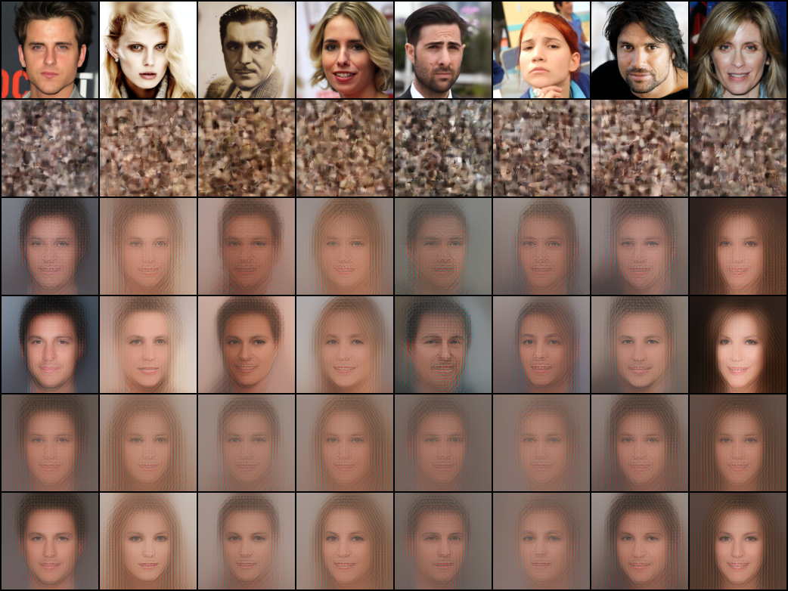
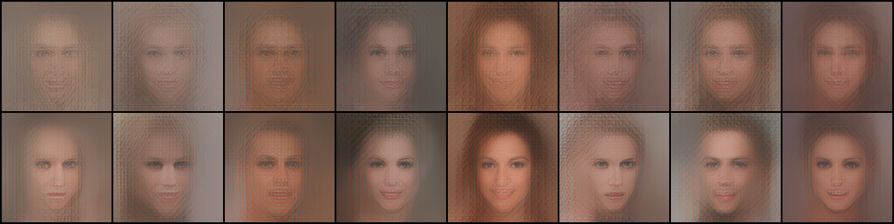
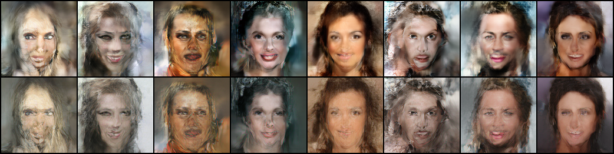

# Diffusion models are schizophrenia machines

Sander Dieleman made a good case that [diffusion is spectral autoregression](https://sander.ai/2024/09/02/spectral-autoregression.html):
noise drowns the high frequencies of an image first, so denoising recovers an image
coarse-to-fine, like autoregression over frequency bands. That's the
signal-processing view.

Here's a more anthropomorphic one: **diffusion models work because they see patterns that aren't there**.

To demonstrate, I built my own madhouse of broken models.

## Setup

Flow matching on the 28,000-image train split of CelebA-HQ at 128×128, in FLUX.2
VAE latent space, with a 22M-parameter DiT:

```
x_t = (1 − t)·x0 + t·x1        x1 ~ N(0, I)
```

t = 1 is pure noise. The model predicts the velocity `v = x1 − x0`.

Normal sampling uses Euler integration with small steps to reach the clean image. However, at any point during sampling, the velocity prediction implies a belief about the final image,

```
x̂0 = x_t − t·v(x_t, t)
```

which we can decode and look at.

## The model that gave up

Train a model **only at t = 1**. Its input is pure noise, containing no information about the target. The optimal prediction it can make is the unconditional mean:

```
v*(x1) = x1 − E[x0]    ⇒    x̂0 = E[x0]
```

The dataset mean, whatever the input. The optimal t=1 model *has given up*: shown noise, it is unable to commit to any specific face. If it incorrectly predicts a woman when the target was a man, the optimizer penalizes it. The only safe prediction is to make no assumption.

Sixteen different noises, one step each:


Nearly the exact same output every time: a front-facing floating head. It has converged to the mean of the dataset:


## The model that started seeing things

Now train an identical model **only at t = 0.9**. Its input is `0.1·x0 + 0.9·x1`. A real face buried under 90% noise. On real noised
images it does what it can: one-step reconstructions are roughly the mean face, with the original's palette, background, and hair darkness leaking
through:


(rows: original / the noised input, decoded / one-step reconstruction)

The optimal prediction now is to recover as much of the signal as possible from the noise, and fill in the rest with the average given the recovered signal.

Now the fun part: we can feed it **pure noise**. There is no face in there. A model that
knew that would output the mean face. Instead:


Same sixteen input noises as before. This model was taught to try to see the faint patterns that exist in the noisy image, so when presented with 100% noise, it still continues to do so. Interpreting the random patterns in the noise as the faint patterns it was trained on.

| source | diversity[^1] |
|---|---|
| t=1 model, one step from pure noise | 10.8 ± 0.1 |
| t=0.9 model, one step from pure noise | 27.3 ± 0.3 |
| t=0.9 model, one step from real noised images | 31.3 ± 0.8 |
| full model (trained at all t), 64-step Euler samples | 81.9 ± 0.5 |
| real data | 111.6 ± 0.9 |

The t=1 model collapses to a point: its 10.8 is jitter around the single mean face, not sixteen different faces.

The t=0.9 model, facing a large train-test mismatch, is 2.5× more diverse.

That diversity can't come from information about the target; pure noise contains none. It comes from the model's learned behavior. Its response to nothing is about 87% as spread out as its response
to something (27.3 vs 31.3 on real noised images): deleting every trace of genuine
signal barely dents its output distribution.[^2]

The model has an ingrained belief that 10% of whatever it sees is real signal,[^3] and its job is to figure out what part of the input is the signal. When presented with 0% signal, it will find the random patterns that most resemble real signal and adopt those instead.

## What would the perfect student see?

An objection: even a Bayes-optimal denoiser is a function of its input, so of course diverse inputs give diverse outputs. Maybe the t=0.9 model isn't seeing things, maybe it's just doing correct inference.

Luckily, for a finite training set the optimal denoiser is exactly computable (the empirical-Bayes denoiser):

```
E[x0 | xt] = Σᵢ softmax_i( −‖xt − 0.1·xᵢ‖² / (2·0.9²) )·xᵢ
```

Here the xᵢ are the 28,000 clean training latents and xt is the input. The formula asks "assuming this input is a 90%-noised training image, which ones could it have been?", weighs every training image by how well 0.1·xᵢ matches the input, and returns the weighted average. That's the exact minimizer of the t=0.9 training loss — the best possible score on the objective our network was trained on — and it's one big matrix multiply.

Now feed it pure noise. The assumption behind the formula is false: there is no training image hiding in the input. But the formula can't say "none of the above", it just weighs chance correlations instead of real ones. So what does the perfect student of this dataset see in static?


(rows: optimal prediction / the training image it retrieved / trained model's
prediction / nearest training image to that. Same noise per column)

It retrieves training photographs, nearly verbatim. Some training image always happens to correlate with a given draw of static better than the rest, and the softmax slams onto it: 61% of the posterior mass goes to a single training image, and only ~2.8 images contribute at all. The "perfect student" looks at static and sees a specific photograph it has memorized.[^4]

Thankfully diffusion models generally don't do that. The inductive biases of neural networks push against memorization: [Kadkhodaie et al.](https://arxiv.org/abs/2310.02557) showed that two diffusion models trained on disjoint halves of a large enough dataset converge to the *same* samples — they learn the distribution, not the photographs. We're seeing their memorization-vs-generalization result at a single noise level.[^5]

"Optimal" is doing a lot of work here: the formula is only the best answer if the 28,000 training images are literally all that exists. The optimum for the *true* distribution of faces would also invent new faces from pure noise. Our network is nowhere near the memorizing optimum — its behaviour is much closer to the true one.

So the objection gets its verdict: doing truly correct inference on this loss means memorizing the dataset. The perfect student is not achievable with normal training, unless we allow memorization. What our model does instead is the imperfect student's inference: it learned the general patterns of faces, and applies them to whatever it is shown, real signal or not.

## Flow matching is a reconstruction objective

Look closer at what the flow matching loss actually teaches. The model predicts the velocity, which itself holds a belief about the clean image (see setup). Strip it all away and the objective is: here is a noisy image, output the clean one, be wrong as little as possible.

The problem is that the model doesn't know which *specific* image is being asked for. The target gives a gradient but no signal at forward time. The same x_t can be built from many different image-noise pairs (trivial example: an image of a face, and the same image but with a single pixel a shade brighter or darker. These are all viable targets for the same x_t). It gets punished for committing to any single one of them. The prediction that minimizes MSE across conflicting targets is the conditional average. The optimal model calculates `E[x0 | xt]`, the average of every image that could possibly have produced this x_t.

At t=1, there is no information given about the target at all, so the outputs converge to the dataset mean. At t=0.9, there is 10% signal, so the outputs converge to the conditional mean given the recovered signal.

Notice that at no point is the model actually trained to generate anything. It is only recovering whatever signal it can and filling in the rest with filler.

We can compute this average exactly if we settle for the best *linear* denoiser. The optimal linear denoiser is the classic Wiener filter, built from just the dataset mean μ and covariance Σ:

```
E[x0 | xt] = μ + 0.1·Σ (0.01·Σ + 0.81·I)⁻¹ (xt − 0.1·μ)
```

It splits the input along the dataset's principal directions, and keeps each one in proportion to how much the dataset actually varies along it: at t=0.9, a direction with variance λ keeps a fraction λ/(λ+81) of itself (81 = 0.81/0.01, the noise-to-signal variance ratio). Everything else gets replaced with the mean.

Our latents have 8192 dimensions. Exactly 4 of them clear λ = 81. About 15% of a real image's variance survives the filter.[^6] So "recover the signal, average the rest" concretely means: keep the palette, the background, roughly the hair darkness, and fill in the rest with the average given those details.



(rows: original / the noised input / trained model reconstruction / Wiener filter reconstruction)

The trained model and the linear filter come back with a recognizably similar image. The network recovers the same handful of coarse attributes the filter does, and everything else it makes up fresh on every noise draw.[^7]

Now feed the Wiener filter pure noise.



(first 8 of the same noises as before. Top: the t=0.9 model. Bottom: the Wiener filter)

It sees things too! It has to, it is told that there is signal, so when only given noise, it picks the points which stand out the most as signal. Tell any signal-recovery system there is 10% signal, and it will find 10% signal, even if it doesn't exist.

So the interesting "seeing things which aren't there" isn't some weird neural network pathology, it is what any signal recovery program would do when given noise and asked to extract signal from it!

We can also run the full sampler with the Wiener filter. Plug it into the same 64-step Euler loop, rebuilding the filter with each step's signal fraction:



(same 8 starting noises. Top: Wiener sampler output. Bottom: trained model output)

The Wiener filter and our tiny diffusion model approach the same face, given the same input noise!

Note: Our diffusion model is currently about on par with a simple linear denoiser, a much larger diffusion model would likely produce significantly better outputs than the Wiener filter would. The Wiener filter is just the optimal *linear* denoiser, not the optimal denoiser period.

## Sampling faces the same mismatch at every step

During training, `x_t` is always built from a real image. During sampling, the state at t = 0.9 is built by *the model itself*: one Euler step of size 0.1 from pure noise, and the t=1 velocity points at the mean face, because it can do nothing else.[^8] So the state we hand to the next step is

```
x_0.9 = 0.9·x1 + 0.1·E[x0]
```

noise plus a faint mean face. If the model followed the only genuine signal in that state, every sample would sharpen into the same averaged floating head.
Instead, unique details emerge. At t=0.9, there is still plenty of noise, and thus plenty of chances to see things which aren't there. The mean face is a blur that no real photo looks like, and the model was only ever trained to flow towards real images, so it does not see the blur as a valid destination. Some of the noise is treated as signal, and some of the mean face is treated as noise!
The model interprets its inputs with its learned priors about what kind of inputs are expected at the given timestep.


(two seeds. Columns alternate between what the model receives and what it believes is in there: prediction at t = 1.0, then input state / prediction pairs at t = 0.9, 0.8, 0.6, 0.4, 0.2, then the final output)

At t = 1 the prediction is always the mean face. Then it drifts toward some specific person that was never in the input. Interpreting some noises as signal, and some mean face as noise. (Eg. Look at the right section of the top row, there's a strip of accidentally brighter noise, which is interpreted as a white background in deeper steps)

Compare with a t = 0.9 state built from a real image. Noise a real photo to t = 0.9, then run the full model's sampling from there (58 steps, the part of the 64-step schedule that lies below t = 0.9). Pose, palette, and composition survive.


(top: original. Bottom: the result of 58-step sampling from its 90%-noised state)

Note the model is not doing anything different in the two cases.
The model is
- Trained to believe a (1-t) fraction of the input is signal
- Only ever trained on real images
- Only ever trained to predict the flow towards real images

When given real signal, (eg 10% at t=0.9), it correctly preserves as much of that signal as possible. When not given proportionate signal, and yet still told there is 10% signal, it discards some mean face as noise, and takes up some noise as signal (eg when it conveniently happens to form something resembling any features it recognizes).[^9]

## Conclusion

So here is the view I've landed on. The flow matching loss is a reconstruction loss. At every noise level, the model is only ever asked to recover a real image from a corrupted version of it. Nowhere in training is it asked to generate anything new.

The generation comes from the train-test mismatch. During sampling, the model is promised signal that isn't there, so it extracts random patterns from the noise and treats them as the signal it expected. That is where the diversity comes from: every draw of noise contains different random patterns, so the model finds a different face in each one.

The spectral story and this one answer different questions. Spectral autoregression explains the *order* the image gets decided in, this post is about where the *content* comes from. I posit that it is simply the model trying to return to its training paradigm of the real data manifold, causing it to hallucinate features that weren't there.

I am not that great at math, and there are people far smarter than me who have written tonnes of math about this. If you think I'm wrong in some major way please reach out to me on [X](https://x.com/SwayStar123), I would love to chat!
This is just my practitioner's take on diffusion.

## Prior art

None of the pieces here are new; the assembly might be. The pareidolia analogy has been made in passing ([xcorr](https://xcorr.net/2023/02/06/denoising-diffusion-models-for-neuroscience/)), and outright by [Ollin Boer Bohan](https://madebyoll.in/posts/dino_diffusion/#why-it-works), whose "why it works" section is titled "denoising-based generation works by iterative pareidolia". The memorization/generalization gap is [Kadkhodaie et al.](https://arxiv.org/abs/2310.02557), who also characterize the inductive bias that does the inventing. The train-test mismatch is the exposure-bias literature ([Ning et al.](https://arxiv.org/abs/2308.15321)), which treats it as a bug; mismatch as the generative mechanism is this post's position. "Hallucination" also has a different technical meaning in diffusion: [Aithal et al.](https://arxiv.org/abs/2406.09358) use it for mode-interpolation artifacts like extra fingers, while this post is about how any sample gets its content at all. The reconstructive view itself is also old: Sander's earlier [diffusion models are autoencoders](https://sander.ai/2022/01/31/diffusion.html) makes it at the level of the objective — generation itself gets an "it turns out you can generate data this way!" — and generation by iterating a denoiser goes back to [Bengio et al. (2013)](https://arxiv.org/abs/1305.6663) and the ["prior implicit in a denoiser"](https://arxiv.org/abs/2007.13640) of Kadkhodaie & Simoncelli. This post is me unpacking that "it turns out".

## Appendix: experimental details

- **Data**: CelebA-HQ train split (28,000 of 30,000 images), 128×128.
- **Latents**: FLUX.2 VAE (`FLUX.2-small-decoder`, ungated), 32×16×16,
  per-channel normalized.
- **Model**: DiT, 22M params — patch 1 over the 16×16 grid, width 384, depth 8,
  6 heads, adaLN-zero on t, fixed 2D sin-cos positions.
- **Training**: flow matching (linear interpolant, velocity target), batch 256,
  AdamW lr 3e-4, 2,500 steps per model, EMA 0.999, bf16. ~10 min per model on one
  RTX 3090.[^10]
- **Models**: `t1` (t ≡ 1), `t09` (t ≡ 0.9), `full` (t ~ U(0,1)), `uncond`
  (t ∈ {1.0, 0.9} 50/50, conditioning frozen to 0).
- **Code**: [here](https://github.com/SwayStar123/schizophrenia-machines).
  `train.py --t-mode {t1,t09,full,uncond}`, then `experiments.py`,
  `fig6_remake.py`, `empirical_bayes.py`, `experiment_uncond.py`,
  `experiment_avg_signal.py`, `variance_check.py`.

[^1]: Throughout: diversity = mean pairwise L2 between outputs in latent space, over 256 inputs; ± is a 95% CI from 16 disjoint 16-sample groups. Figures show the first few of the same seeds.

[^2]: The gap is real (31.3 ± 0.8 vs 27.3 ± 0.3) — the genuine signal does *some* work — and the pure-noise outputs actually sit slightly farther from the mean face (24.6 vs 23.1). Also, pure noise is ~10% "hotter" than the t=0.9 marginal, so these inputs are detectably out-of-distribution; the model confabulates on them anyway. Cf. the unconditioned model in footnote 3, which learns to use exactly that gap.

[^3]: Unless the model gets to infer the noise level from the input itself. Train a variant on both t = 1.0 and t = 0.9 with the timestep input frozen and it learns to tell the two apart from the input norm alone (pure noise has std 1.0, the t=0.9 marginal ≈ 0.906 — in 8192 dimensions that's a clean separation, which is also why [noise conditioning is largely unnecessary](https://arxiv.org/abs/2502.13129)). On pure noise this model outputs the mean face: it detects "nothing there" without ever being told. But rescale pure noise by 0.906 so its norm matches the t=0.9 marginal and the hallucinations come right back, at over 90% of its response to genuinely noised real faces ([fig11](outputs/fig11_uncond.png)). Its reality check is a loudness check.

[^4]: Distances for scale: the optimal denoiser's outputs sit at 33 from their nearest training image, the trained model's at 69, and a real latent's average distance to its *nearest neighbor* in the training set is 88.5 ± 1.4. (Nearest- neighbor distance — a different yardstick from the pairwise diversity numbers.)

[^5]: Invention isn't an optimization failure; it's what correct generalization looks like, and the network's inductive biases luckily deliver it. Relative to the empirical optimum the model hallucinates worse than optimally — which is to say, better than the finite data alone could justify.

[^6]: This 15% is the ceiling for *linear* denoisers, not for denoisers in general — the empirical-Bayes formula from the last section happily recovers a training image almost exactly from 10% signal, because "which of the 28,000 is it" is far less information than "what does the image look like". And it's a ceiling of the model class, not the data: 28,000 images pin the covariance down well, and more data barely changes it.

[^7]: Checked by noising the same image 256 different ways and averaging the model's reconstructions: the made up details cancel between draws, the consistently recovered part stays. That average points the same way as the exact linear answer (cosine similarity 0.86, measured against the mean face), and the made up part of a single reconstruction is as large as the recovered part (16.8 vs 15.6 in latent distance). Half signal recovery, half invention.

[^8]: Not an artifact of the crippled t=1-only model: the full model also produces sixteen identical mean faces in one step from t = 1 ([fig4](outputs/fig4_full_onestep_t1.png)), yet its 64-step samples ([fig5](outputs/fig5_full_euler_grid.png)) reach diversity 81.9 vs the real data's 111.6 — under-dispersed, as deterministic ODE samplers tend to be, but in the right league.

[^9]: In the idealized limit — exact population velocity field, infinitesimal steps — the probability-flow ODE is a clean measure transport: no exposure bias, no "hallucination" needed, diversity riding in on the initial noise. But that ideal isn't available from finite data; its nearest well-defined version is the empirical-Bayes ODE, which is a memorizer. Every novel face comes from the network filling in the transport map where the training objective never pinned it down.

[^10]: 2,500-step tiny models, not SOTA anything. That's rather the point: none of these effects require scale, they fall out of the objective.
